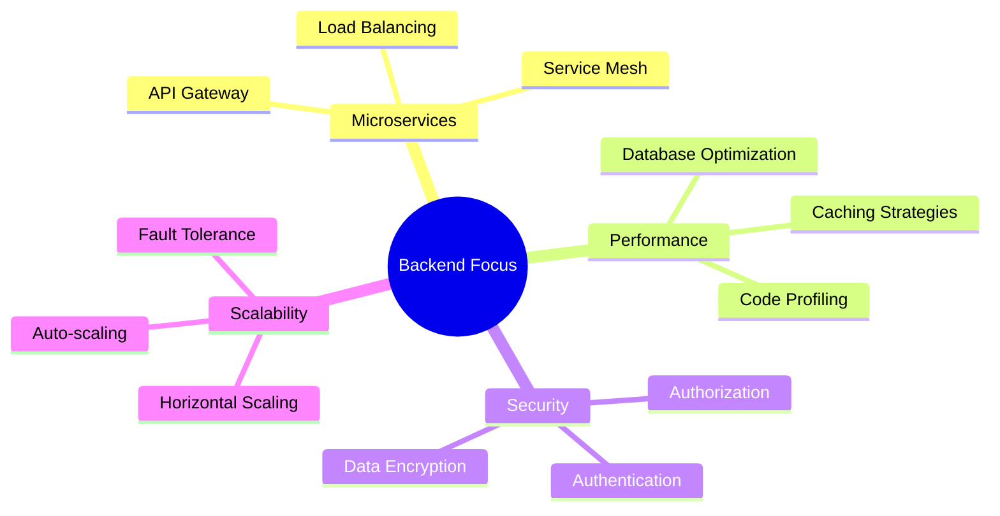

<div align="center">

# 🚀 BithorSon | Backend Developer


[](https://git.io/typing-svg)

---


</div>

## 🎭 **Who Am I?**


```typescript
Backend Developer {
  name: Bithorson;
  role: Backend Developer;
  location: Chennai;
  languages: Tamil, English;
  contact: +919791528623;
  mail: bithorson2405@gmail.com;

}

const bithor: Developer = {
  name: "BithorSon",
  role: "Backend Developer",
  location: "Building the Future, One API at a Time",
  languages: ["Python", "Django", "Django FrameWork","Html", "Css", "JavaScript"],
  architecture: ["Microservices", "REST APIs", "System Design"],
  databases: ["PostgreSQL", "Redis", "MongoDB"],
  cloud: ["AWS", "Docker", "Kubernetes"],
  currentFocus: ["Distributed Systems", "Performance Optimization"],
  lifePhilosophy: "Code with Purpose, Build with Passion"
};
```

<br clear="right"/>

---

## 🎯 **My Expertise**

<div align="center">

<table>
<tr>
<td align="center" width="50%">

### 🏗️ **Backend Architecture**


**System Design** • **API Development**  
**Database Optimization** • **Scalable Solutions**

</td>
<td align="center" width="50%">

### ☁️ **Cloud & Infrastructure**


**AWS Services** • **Containerization**  
**CI/CD Pipelines** • **Performance Monitoring**

</td>
</tr>
</table>

</div>

---

## 🛠️ **Technology Stack**

<div align="center">

### **Languages & Core Technologies**


### **Backend & Databases**


### **Cloud & DevOps**


### **Tools & Frameworks**


</div>

---

## 📊 **GitHub Analytics Dashboard**

<div align="center">


</div>

---

## 🏆 **Achievements & Recognition**

<div align="center">


</div>

---

## 🔥 **Current Projects & Focus**

<div align="center">



</div>

### **🚧 What I'm Building**

<table>
<tr>
<td align="center">

<br><strong>Scalable APIs</strong>
<br><sub>High-performance REST & GraphQL</sub>
</td>
<td align="center">

<br><strong>System Architecture</strong>
<br><sub>Microservices & Distributed Systems</sub>
</td>
<td align="center">

<br><strong>Database Solutions</strong>
<br><sub>Performance & Optimization</sub>
</td>
<td align="center">

<br><strong>Cloud Infrastructure</strong>
<br><sub>AWS & Container Orchestration</sub>
</td>
</tr>
</table>

---

## 🤝 **Let's Connect & Collaborate**

<div align="center">


### **Professional Networks**

[](https://www.linkedin.com/in/bithor-son-177abb26a/)
[](https://github.com/bithorson1)
[](https://stackoverflow.com/users/26406139/bithor-son)
[](mailto:your.email@example.com)

### **Available for**
🚀 **Backend Development Roles** • 🤝 **Open Source Collaboration** • 💡 **Technical Consultations**

</div>

---

## 💭 **Philosophy & Inspiration**

<div align="center">


### *"Building robust systems that scale with purpose and precision"*


---


[](https://github.com/bithorson1?tab=followers)
[](https://github.com/bithorson1?tab=repositories)

**⭐ Star my repositories if you find them interesting!**

</div>
